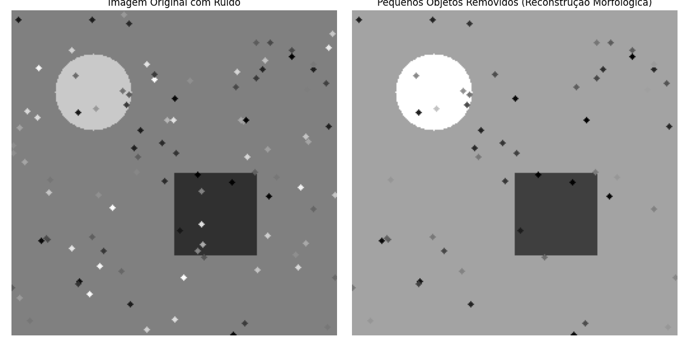
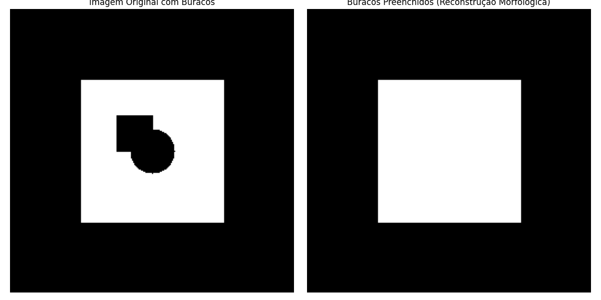

# Reconstrução Morfológica em Níveis de Cinza 🧠🖼️

Projeto desenvolvido para a disciplina de Processamento Digital de Imagens (PDI) — UFAL — Junho de 2025.

Este repositório demonstra, com exemplos práticos, a aplicação de reconstrução morfológica em imagens em níveis de cinza, usando Python e bibliotecas como OpenCV e scikit-image.

---

## ✨ Objetivos

- Introduzir a técnica de reconstrução morfológica em imagens em tons de cinza.
- Demonstrar seu uso prático para:
  - 🧹 Remoção de ruídos e pequenos objetos indesejados.
  - 🕳️ Preenchimento de buracos em objetos.
- Comparar os resultados obtidos com imagens reais/sintéticas.

---

## 🧠 Conceitos Principais

- **Reconstrução Morfológica**: Técnica que utiliza uma imagem "marcadora" e uma "máscara", com operações iterativas de erosão ou dilatação até estabilização.
- **Dilatação/Erosão Condicional**: Versões adaptadas das operações morfológicas clássicas, limitadas por uma máscara.
- **Aplicações**: Pós-processamento de segmentações, refino de contornos, supressão de ruídos.

---

## 📁 Estrutura do Projeto

```
scr/
├── images/
│   ├── input/
│   └── output/
├── main.py
├── morph_reconstruction.py
└── utils.py
```

---

## ▶️ Como Executar

### 1. Clone o repositório:

```bash
git clone https://github.com/seuusuario/reconstrucao-morfologica-pdi.git
cd reconstrucao-morfologica-pdi/src
```

### 2. Instale as dependências:

```bash
pip install -r requirements.txt
```

> Ou instale manualmente:
```bash
pip install numpy matplotlib opencv-python scikit-image
```

### 3. Execute o script:

```bash
python main.py
```

As imagens processadas serão salvas em `images/output`.

---

## 🖼️ Exemplos Visuais

### 1. Remoção de Ruídos


### 2. Preenchimento de Buracos



---

## ⚠️ Limitações

- Dependência de um marcador bem definido.
- Alto custo computacional em imagens grandes.
- Aplicabilidade direta apenas a imagens em tons de cinza.
- Pouca robustez em imagens com muita variabilidade ou ruído estrutural.

---

## 📚 Referências

- Soille, P. *Morphological Image Analysis: Principles and Applications*. Springer, 2003.
- Gonzalez & Woods. *Digital Image Processing*. Pearson, 2018.
- Documentação oficial do [scikit-image](https://scikit-image.org/).

---

## 📌 Licença

MIT License

---

## 👨‍💻 Desenvolvedores 

Jorge Lucas Firmino da Silva de Sá
José Carlos Silva Santos 
José Vinicius Cavalcante Soares
Liedson da Silva Santos
Samuel Jonas Cavalcante Lima 

